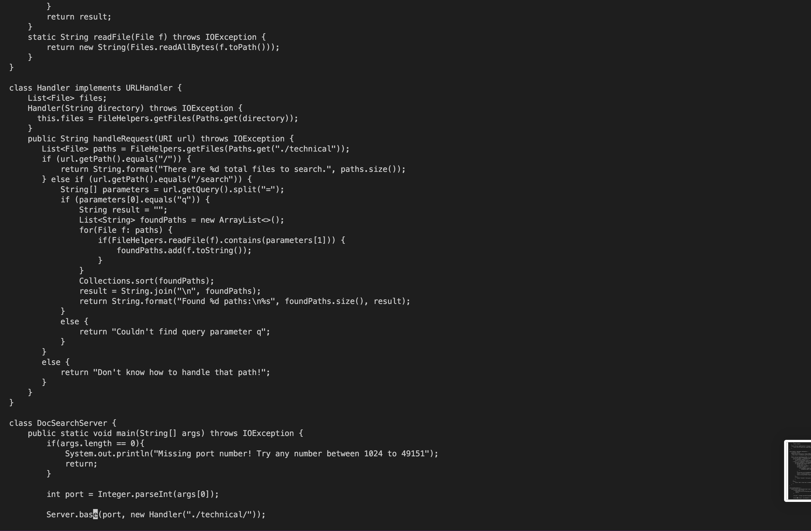

# lab report 4
# first part
The one I'm doing is: In DocSearchServer.java, change the name of the start parameter of getFiles, and all of its uses, to instead be called base. 
`cd week6-skill-demo1
vim DocSearchServer.java
/start <enter> ce base <escape> n . n . n . n :wq <enter>`

Step by step:
1. After typing `cd week6-skill-demo1
vim DocSearchServer.java /start`  
/start means that we will search the word start in the file.

2. Aftrer typing `ce` 
`c` stands for change and `e` stand for moving to the end of a word. And since we are changing the file, we are in insert mode. 

3. Aftrer typing `base` 
we type in "base" to switch off start and change it to "base".

4. Aftrer typing `<esc>` 
we exit the insert mode and back to the normal mode.

5. After type in `n` 
`n` stand for repeating the last search from the cursor's position.

6. After typeing `.` 
`.` will repeat the last change.

7. After type in second `n` 
`n` stand for repeating the last search from the cursor's position. Which will take us to the next "start".

8. After typeing the second `.` 
`.` will repeat the last change. Which will change the start to base.

9. After type in the third `n` 
`n` stand for repeating the last search from the cursor's position. Which will take us to the next "start".

10.  After typeing the third `.` 
`.` will repeat the last change. Which will change the start to base.

11. After type in the fourth `n` 
`n` stand for repeating the last search from the cursor's position. Which will take us to the next "start". And since we don't hhave another "start". It shows "Pattern not found: start"

12. After type in `:wq <enter>`  
`:` bring us to the command line and `w`help us save the file and we use `q` to quit the file.
13. The screenshot after we quit the file.

# second part
For the method with editting in the local, scp and run on the remote, I took around 53.2 seconds to get the result.
However, for the method with on the remote first and edit in vim, I spent around 42.6 seconds to get the result. 

Which of these two styles would you prefer using if you had to work on a program that you were running remotely, and why? 
 
In my opinion, if I get used to how to use vim and know a lot of method to edit a file in vim, I would choose the second method. Because for this method, It is more convenient and faster even though I haven't get used to vim yet. The first method is a decent method too, but it is slower and the scp running time may sometimes be long.

What about the project or task might factor into your decision one way or another? (If nothing would affect your decision, say so and why!)
 
 
I think when we only need to change small part of a file the time difference between two methods might not be that much. However, when the file we need to change is long and we need to change lots of part in the file, or we need to use some method to change it, such as searching, copy and paste... it will make the second method way faster than the first one. Therefore, when the file we need to change is long and thare are a lot of part we need to change, I will fastor my decision to prefer the vim method, but when we don't need to change too much stuff in the file, both methods are fine for me.
